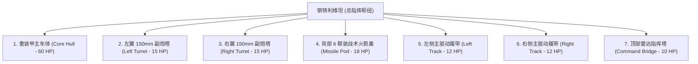

# 模块四：钢铁利维坦 BOSS 多部位破坏与阶段演进系统

---

## 🎯 BOSS 结构分拆与部位独立判定（Multi-Part Hierarchy）

巨型陆地巡洋要塞「钢铁利维坦」拥有 7 个独立的碰撞网格与生命判定部位：

---

## 💥 部位破坏与战术收益机制

1. **摧毁副炮塔（Left/Right Turret）**：
   - 局部引发强烈黑烟与火花大爆炸，该炮塔永久断裂垂落；
   - BOSS 永久失去该侧的持续火力压制能力。
2. **摧毁战术火箭巢（Missile Pod）**：
   - 触发内部火箭殉爆，并扣除 BOSS 总血量 10 点；
   - 彻底解除 BOSS 阶段二的「全屏火箭弹幕」威胁。
3. **摧毁履带总成（Left/Right Track）**：
   - 履带崩断散落一地，BOSS 移动速度直接下降 50%（若双侧皆被摧毁，则完全原地瘫痪无法转向）。
4. **摧毁指挥塔（Command Bridge）**：
   - BOSS 索敌准度大幅下降，且进入 4 秒过载硬直状态。
